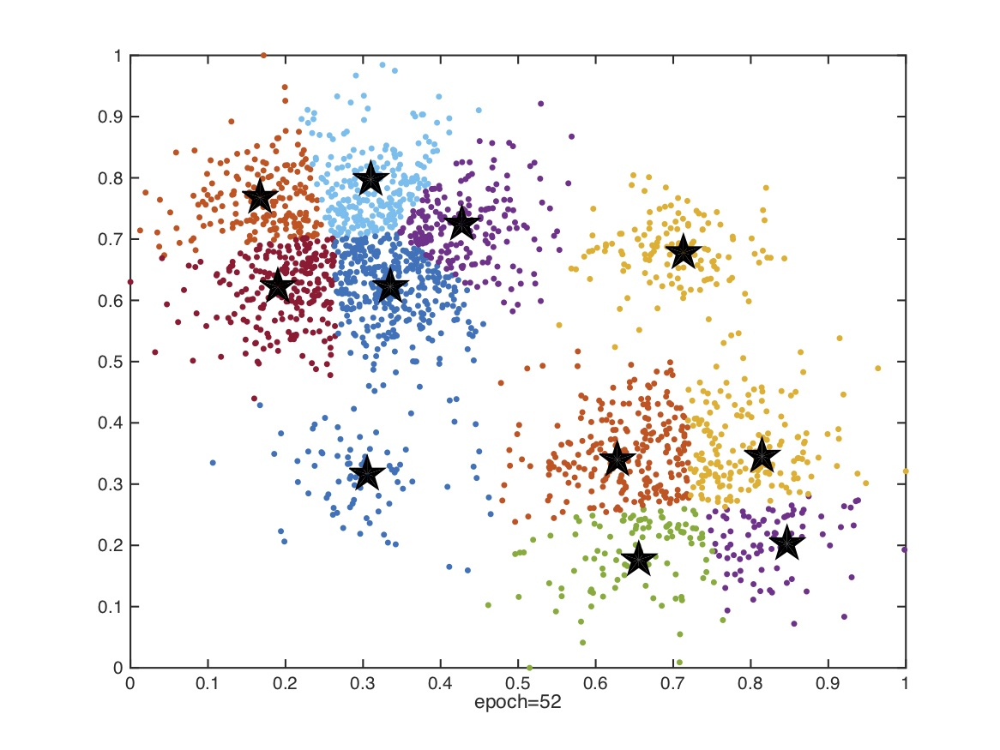
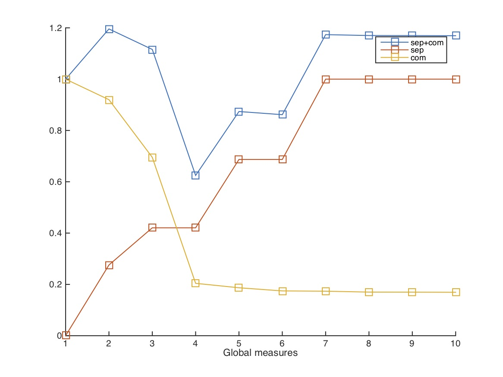
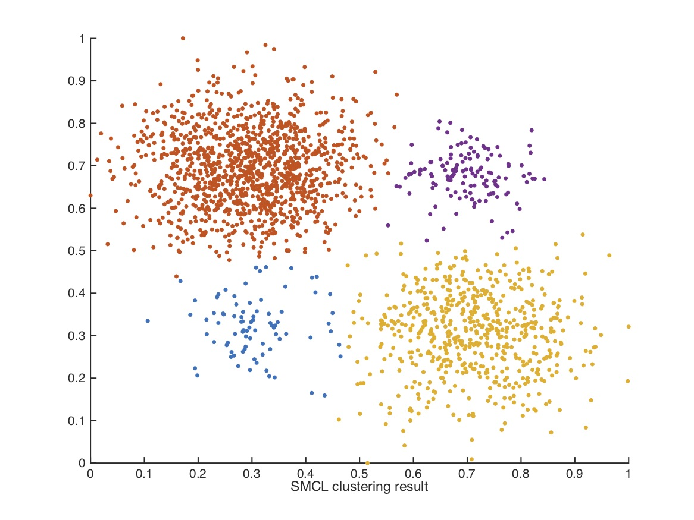
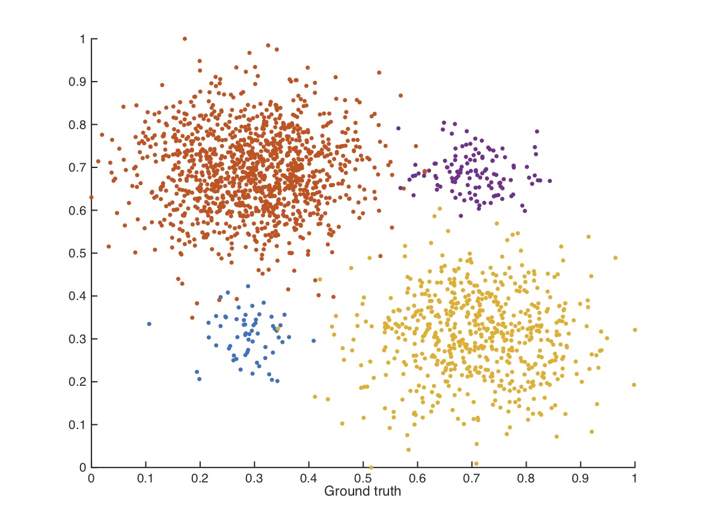

## Introduction

Matlab code of SMCL (Self-Adaptive Multi-Prototype-based Competitive Learning)

Author: [Yang Lu](https://jasonyanglu.github.io/)

Contact: lylylytc@gmail.com


## Demo

Number of seed points are gradually increased until one seed point is driven away by competitive learning.


## Usage

Directly run smcl.m with dataset name as argument. For example:

```shell
smcl gaussian
```


## Output Example

The codes output four figures and a set of numerical metrics.

Command line output:

```
>> smcl gaussian
SMCL starts on dataset gaussian...
epoch 1
epoch 2
epoch 3: duplicate seed point 1
epoch 4
epoch 5
epoch 6
epoch 7: duplicate seed point 1
epoch 8
epoch 9
epoch 10
epoch 11: duplicate seed point 4
epoch 12
epoch 13
epoch 14
epoch 15
epoch 16
epoch 17: duplicate seed point 2
epoch 18
epoch 19
epoch 20: duplicate seed point 1
epoch 21
epoch 22
epoch 23: duplicate seed point 4
epoch 24
epoch 25
epoch 26: duplicate seed point 7
epoch 27
epoch 28
epoch 29: duplicate seed point 5
epoch 30
epoch 31: duplicate seed point 10
epoch 32
epoch 33
epoch 34
epoch 35
epoch 36
epoch 37
epoch 38
epoch 39
epoch 40
epoch 41
epoch 42
epoch 43
epoch 44
epoch 45
epoch 46
epoch 47
epoch 48: duplicate seed point 9
epoch 49
epoch 50
epoch 51
epoch 52: drive seed point 8 out
Finish SMCL in 72.6719 second

smcl_result = 

            acc: 0.9810
            pre: 0.9868
            rec: 0.9070
           fval: 0.9819
            ari: 0.9606
            nmi: 0.9103
            dcv: 0.0371
    cluster_num: 4
```


Final positions of seed points by PNS:



Global separability, global compactness and their sum:



Clustering result of SMCL:



Gournd truth of the dataset:




## Datasets

Four synthetic datasets are provided:

1. gaussian
2. ids2
3. banana
4. lithanian

For the details of the datasets, please refer to the experiment part of the paper.


## Paper

Please cite the paper if the codes are helpful to you research.

Yang Lu, Yiu-ming Cheung, and Yuan Yan Tang, "Self-Adaptive Multi-Prototype-based Competitive Learning Approach: A k-means-type Algorithm for Imbalanced Data Clustering", _IEEE Transactions on Cybernetics (TCYB)_, DOI:10.1109/TCYB.2019.2916196.